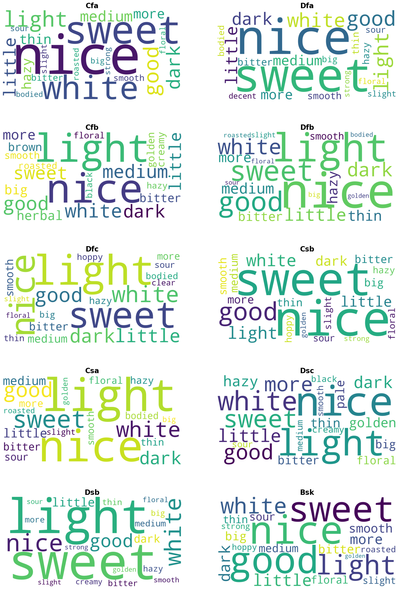

<head>
  <meta charset="UTF-8">
  <meta name="viewport" content="width=device-width, initial-scale=1.0">
  <title>Two Images Side by Side</title>
  
</head>

## 🍻 Introduction

### Beer Reviews

If you live in Switzerland and have ever been to South America, you have probably noticed that people are more outgoing, warmer and approachable there. Well, that’s not just your perception: the climate you live in really does shape your personality. In fact, research shows that if you live in a warmer climate, you tend to have greater social tendencies, emotional stability, extroversion, and openness to new experiences ([Wei et al., 2017](https://www.nature.com/articles/s41562-017-0240-0)). 

If climate makes us different, there is for sure something that we all share: our love for beer. Yes, the amber elixir that brings people together across continents. But, hang on, could there be a mysterious link between the climate that molds our personalities and the way we savor our beers? 

In order to answer this enigmatic question we need data! Luckily, people around the world have been rating beers for a long time on websites like *Beer Advocate* or *Rate Beer*. 

   
  

From these platforms, we gathered 1.2M reviews from 63K American users evaluating 27K different beers of 104 different types ([dataset](https://drive.google.com/drive/folders/1Wz6D2FM25ydFw_-41I9uTwG9uNsN4TCF)). 
A complete review looks like this:

  

A review on *Beer Advocate* contains the following information:\
🍺 The **name** of the beer.\
🍺 The **style** of the beer.\
🍺 The **alcohol** by volume.\
🍺 The **name** of its brewery and its location.\
🍺 The **username** of the author and its location.\
🍺 A **rating** indicated in red, that ranges from 1 to 5.\
🍺 The relative difference, denoted **rDev**, between the rating given by the user and the average rating of the beer considering all reviews it received.\
🍺 A list of 5 scores: **look**, **smell**, **taste**, **feel**, and **overall**.  These also range from 1 to 5. Note that the **rating** is not directly obtained from these, nor is the **overall** related to the other scores.\
🍺 The **text** of the review.\
🍺 The **date** and **hour** when the review was posted.

We work with all the review features except the **rating** and **rDev** ones as these are not available on *Rate Beer*.

### Climate Data

As we are interested in studying the impact of climate on the beer reviews, we have to choose what climate data to use. While many climate classifications exist, we'll be using the popular Köppen climate classification:

  

Let's look at the [climates in the US](https://weatherandclimate.com/united-states). There are 10 different climates in the US. These are:

| Scheme | Seasonal precipitation                 | Temperature             |
|--------------------------------------|----------------------|------------------|
| **B (Dry)**                               | s (Semi-Arid or steppe) | k (Cold)      |
| **C (Temperate)**                         | f (No dry season)      | a (Hot summer)   |
|                                           | s (Dry summer)    | b (Warm summer)  |
| **D (Continental)**                       | f (No dry season)      | a (Hot summer)   |
|                                           | s (Dry summer)  | b (Warm summer)  |
|                                           |                 | c (Cold summer)  |

Now that we have lots of data, let's dive into it! 🤿

## 🍻 Climate and beers

To explore how climates could impact the appreciation of beer, we look at the general distribution of each score per climate. We first look at the average **overall** score per climate. We also show the micro-average:

   
  

We can also look at the other scores:

   
  

From these plots, we can see that each sub-rating follow similar trends. This means that if there is an influence of climate on the scores, its impact is rather the same across all score categories. This is less the case for the appearance score, which stays rather constant across all climates. 

Keeping in mind that the y-axis does not start at zero on these plots, we still observe a difference of around 4 percent between the climate having the largest **overall** score, and the one having the lowest. **Csa** and **Dfa** have the highest scores. These climates have a **hot summer** which might make the users more inclined to appreciate beers in general because of the social aspect and their appreciation for a cold drink on a hot summer day. On the other hand, **Dsb** and **Dsc** climates give ratings under the averages. Both of these are **continental** and **Dsc** has a **cold summer**. Would it then be the case that people living in colder climates have higher beer expectations and standards?

Looking at the plot of the climate zones in the US, we can see that **Dsb** and **Dsc** only cover two states: Idaho and Washington. We can also check the number of reviews per climate:

   
  

One-way ANOVA tests show that the difference in means between the climates is not statistically significant (using a 95% confidence level). Note that this is the statistical test that we will be using throughout the entire report unless specified otherwise. 

It appears that the different climates are imbalanced with respect to the number of reviews. We thus have to group climate zones together if we want to have enough beers in all groups. This is what we are going to explore next!

### Climate factors and beers

In this part, we group the climate zones based on their **scheme**, **seasonal precipitation**, and **summer heat level** as specified in the Köppen climate classification discussed in the introduction. 

The means of the different scores are shown in the figures below:

   
  

 

  

    
    
  

 

Looking at the first figure, **dry climates** show smaller average **overall**, **aroma**, **taste** and **palate** scores than the other climates. The difference in means between the different climate groups for each of these scores is statistically significant. However, the **appearance** scores are much more similar across **temperate**, **continental** and **dry climates**, and their difference is not statistically significant.

<!-- 

   
  

 -->

Looking at the **climate precipitation**, the average scores stay rather constant across climates. The **overall** score is larger in the **dry climates**, while the **taste**, **palate**, **aroma** and **appearance** are larger in climate zones that don't have **dry seasons**. 

<!-- 

   
  

And at the summer temperature:

   
   -->

**Hot and warm summers** show very similar average scores. There is however a much larger difference with **cold summer** which shows lower scores across all categories. A t-test reveals that the difference in means between the cold summer climate and the two other climates is statistically significant.

### Conclusion on climate and scores

🍺 First of all, there appears to be a correlation between the climatic conditions and the average ratings. Climate is known to influence personality traits, and it may also influence beer preferences.

🍺 What we have seen is that areas with **hot summers** also have larger beer scores, which could be because of the social and refreshing aspects of beer consumption in warmer areas.

🍺 On the other hand, we have also observed that **colder climates** are associated with lower scores, which may come from the fact that people in **colder climates** have higher expectations or different standards of beer. 

🍺 The **appearance** score was the most stable one across the different climate regions, maybe because it is also the hardest criterion to rate, as opposed to the **palate** and the **taste** that may have a larger impact on people's beer appreciation. 

## 🍻 Climate and styles of beers 

Having unraveled the preliminary layers of our investigation into the impact of climate trends on beer reviews, we now pivot our analytical lens toward the world of beer types. 

The initial exploration revealed how **overall**, **taste**, **aroma**, **appearance**, and **palate** ratings are influenced by climatic conditions. However, understanding the nuanced relationship between climate and beer preference requires a deeper look into the styles of beers. Do users from certain climates have preferences for certain beers?

There exist a lot of beer styles. In our dataset only, there were 104 of them. To have a more meaningful analysis we mapped them to 10 general styles. The ten styles are: **Lager**, **Pale Ale**, **Blonde Ale**, **Brown Ale**, **IPA**, **Wheat beer**, **Porter**, **Stout**, **Sour Ale**, **Scottish Ale**. 

*Fun fact*: This mapping was performed manually following an article by EHL (https://hospitalityinsights.ehl.edu/beer-types). 👍

Here is a visualization of the style's ranking:

   
  

The size of each of the style names is proportional to their average **overall** score. A style appearing in a larger font size is therefore preferred over the ones shown in smaller sizes.

  

Now, let's take a look at the mean **overall** score given to each beer by the respective climates:

   
     

For each climate, there exists a statistically significant difference (at  95% confidence level - as indicated by the absence of overlap between the error bars) between the **overall** scores of most beer styles. This difference in beer style preference is similar across climates, leading us to think that people from different climates tend to have very similar style preferences. We then looked at how the mean **overall** score changed across climates, for each beer style. On this plot, we've added the micro average, i.e. the **overall** mean over the climates.

   
     

However, when ranking the best beers per climate group, we can immediately notice that there is very little variability between the climate groups. In fact, the difference is not statistically significant. The confidence intervals of the means overlapped.

Maybe the variability lies in the climate subgroups. To look into this, we computed the best-ranked beers, i.e. the ones having the best average **overall** score, and the most popular ones, i.e. the most reviewed ones per climate subgroup. Here are the results:

 

<table style="border-collapse: collapse; border: 2px double black;">
  <tr>
    <td></td>
    <td colspan="3" align="center">Scheme</td>
    <td colspan="2" align="center">Precipitation</td>
    <td colspan="3" align="center">Temperature</td>
  </tr>
  <tr>
    <td><b>Rank</b></td>
    <td><b>Temperate</b></td>
    <td><b>Continental</b></td>
    <td><b>Dry</b></td>
    <td><b>Without dry season</b></td>
    <td><b>With dry season</b></td>
    <td><b>Hot summer</b></td>
    <td><b>Warm summer</b></td>
    <td><b>Cold summer</b></td>

  </tr>
  <tr>
    <td>1st</td>
    <td>Sour Ale</td>
    <td>Sour Ale</td>
    <td>Sour Ale</td>
    <td>Sour Ale</td>
    <td>Sour Ale</td>
    <td>Sour Ale</td>
    <td>Sour Ale</td>
    <td>Sour Ale</td>
  </tr>

  <tr>
    <td>2nd</td>
    <td>Stout</td>
    <td>Stout</td>
    <td>Stout</td>
    <td>Stout</td>
    <td>Stout</td>
    <td>Stout</td>
    <td>Stout</td>
    <td>Stout</td>
  </tr>

  <tr>
    <td>3nd</td>
    <td>IPA</td>
    <td>IPA</td>
    <td>IPA</td>
    <td>IPA</td>
    <td>IPA</td>
    <td>IPA</td>
    <td>IPA</td>
    <td>IPA</td>
  </tr>

  <tr>
    <td>4th</td>
    <td>Porter</td>
    <td>Porter</td>
    <td>Porter</td>
    <td>Porter</td>
    <td>Porter</td>
    <td>Porter</td>
    <td>Porter</td>
    <td>Porter</td>
  </tr>

  <tr>
    <td>5th</td>
    <td>Brown Ale</td>
    <td>Brown Ale</td>
    <td>Brown Ale</td>
    <td>Brown Ale</td>
    <td>Brown Ale</td>
    <td>Brown Ale</td>
    <td>Brown Ale</td>
    <td>Brown Ale</td>
  </tr>
</table>

   

<table style="border-collapse: collapse; border: 2px double black;">
  <tr>
    <td></td>
    <td colspan="3" align="center">Scheme</td>
    <td colspan="2" align="center">Precipitation</td>
    <td colspan="3" align="center">Temperature</td>
  </tr>
  <tr>
    <td><b>Popularity</b></td>
    <td><b>Temperate</b></td>
    <td><b>Continental</b></td>
    <td><b>Dry</b></td>
    <td><b>Without dry season</b></td>
    <td><b>With dry season</b></td>
    <td><b>Hot summer</b></td>
    <td><b>Warm summer</b></td>
    <td><b>Cold summer</b></td>

  </tr>
 

  <tr>
    <td>1st</td>
    <td>IPA</td>
    <td>IPA</td>
    <td>IPA</td>
    <td>IPA</td>
    <td>IPA</td>
    <td>IPA</td>
    <td>IPA</td>
    <td>IPA</td>
  </tr>

  <tr>
    <td>2nd</td>
    <td>Pale Ale</td>
    <td>Pale Ale</td>
    <td>Pale Ale</td>
    <td>Pale Ale</td>
    <td>Pale Ale</td>
    <td>Pale Ale</td>
    <td>Pale Ale</td>
    <td>Pale Ale</td>
  </tr>

  <tr>
    <td>3rd</td>
    <td>Brown Ale</td>
    <td>Brown Ale</td>
    <td>Brown Ale</td>
    <td>Brown Ale</td>
    <td>Brown Ale</td>
    <td>Brown Ale</td>
    <td>Brown Ale</td>
    <td>Brown Ale</td>
  </tr>

  <tr>
    <td>4th</td>
    <td>Porter</td>
    <td>Porter</td>
    <td>Porter</td>
    <td>Porter</td>
    <td>Porter</td>
    <td>Porter</td>
    <td>Porter</td>
    <td>Porter</td>
  </tr>

  <tr>
    <td>5th</td>
    <td>Stout</td>
    <td>Stout</td>
    <td>Stout</td>
    <td>Stout</td>
    <td>Stout</td>
    <td>Stout</td>
    <td>Stout</td>
    <td>Stout</td>
  </tr>
  
</table>

 

We see that the ranking and popularity are similar across climate subgroups. This means that the style of the beers is not what causes the variability in the scores. Something interesting we have learned through this analysis is that the best-ranked beer style is not the one that is the most reviewed by Americans. The following plot summarizes the highest-ranked and most popular styles.

   
     
  

In summary, for each climate, the difference in the mean of the **overall** scores across beer styles is significantly different. However, for all beer styles, the **overall** score means across climate groups are very similar. This is the case with all of our climate groupings. Therefore, the beer style rankings do not seem to be affected by the climate. This can make us think that there is a different appreciation of the beers in general (ie. higher or lower ratings for all beer styles), but the order of their preference is the same. We therefore need to find a new parameter to investigate, which could clarify the difference in ratings given to the various beers.

One of the potential explanations for this is the fact that the chosen general types regroup many different kinds of beers into one. By investigating the beer features we found that the alcohol by volume (ABV) has a big variability inside of each beer style, as one can see in the following plot:

   
  

This plot shows, for each beer, the interquartile range, meaning that 50% of the beers of each style have an ABV value between the brackets. 

### Conclusion on beer styles and scores

🍺 We saw earlier that the orders of the beer styles are the same across climates. However, we also saw in the first part that the different scores varied across climates. 

🍺 A potential explanation would be that there is a large variability in the beer ABV within each style. Consequently, two people might like beers of the same style but that are actually very different with respect to their ABV. 

🍺 The styles are therefore not a good grouping factor when studying the correlation between climate and scores.

🍺 The ABV could be a parameter that is more important than the beer style itself. We therefore decided to investigate the ABV and its relation to the climate groups.

## 🍻 Climate and Alcohol Level of Beers

[A group of researchers](https://dom.pitt.edu/people-drink-more-in-colder-regions-bataller-led-study-finds/) at the University of Pittsburgh found a negative correlation between some climate factors and alcohol consumption. In particular, as the temperature drops, the average alcohol consumption increases. But does this mean that people drink a larger quantity of alcoholic drinks, or rather that people drink beverages of higher abv? Let’s investigate! 

### Focusing on ABV per climate

In order to do so, let’s study the ABV rating for each beer and find possible correlations with climate factors. We use the number of rankings given to a beer as a measure of popularity and their **overall** score as a measure of preference. As for the climate factors, we use the ones described earlier: **climate**, **scheme**, **seasonal precipitation**, and **heat level**.

We plot below the distribution of the **ABV** of the reviewed beers:

   
  

As shown on the boxplot, the rated beers are centered around a mean ABV of 7.0°, and half are contained in the [5.4°, 8.0°] range. We want to know how this distribution differs in the different climate categories. 

First, we compare the popularity and preference of the beers in the different climate conditions based on their **ABV**. From the grouped climates, we find the three most liked beer styles and the three most reviewed. For the rest of this part, we always use the three best beers and the three most reviewed beers.

   
   

By looking at the two U.S. maps above, we can see that there is a variation in the **ABV** average between the best beers and the most reviewed beers. It results that the **ABV** mean of the three favorite beers is higher than the one of the three most popular ones. We can observe a variation across the climates but again, too many climates at a time make the results hard to interpret. The one-way test reveals that the differences in means are not statistically significant. We will therefore analyze the three climate levels separately.

Note that for the three next plots, the ranges of the color bars are not equal on the left and right plots. This was chosen to better visualize the differences within each plot and because the average **ABV** of the best beers is always higher than for the most reviewed ones.

   
   

The resulting plots show a smaller **ABV** for the users living in a **dry climate** than for the ones living in **temperate** or **continental climates**. This is true for both the best beers and the most reviewed beers. 

This seems counterintuitive as one could think people living in a **colder climate** drink beers that are stronger to create a warming sensation, whereas, in a **dry climate**, they drink beers with a lower **ABV** as they consume beers as a refreshing drink. Moreover, opposing dry and cold does not make sense here since the only **dry climate** that we have is the **Bsk** climate which is a **cold climate**.

Let's now look at the precipitation:

   
   

For the **seasonal precipitation** groups, the best beers have a higher **ABV** in locations **without a dry season** than in those with. In contrast, we can notice that, for the most reviewed beers, there is an increase in **ABV** for regions **with dry seasons**, but the difference is not as big as for the best beers.

<!-- These results could be mitigated by some confounders, mostly one can notice that the separation is East-West and there are way more reviews on the East Coast than on the West Coast. This could be due to the fact that the East Coast is more populated than the West Coast. Therefore, we cannot conclude that climate precipitation is the only factor that influences the ABV of the beers. -->

We finally look at the temperature:

   
   

Lastly, when observing the temperature of summer, the **ABV** is higher in regions with a **hot summer** than in those with a **cold summer**. This is true for both the best beers and the most reviewed beers. The variation is also the biggest among the different climate categories.

### Analysis of ABV

🍺 In all cases, we can notice that there is a small difference in ABV means. The typical difference is around 0.1° and the highest variation for one chosen climate category is when we compare **hot and cold summer**. 

🍺 The first main result we find is that U.S. citizens prefer beers with higher ABV than the average ABV of the most consumed ones. This is true for all climate categories. Indeed, in the case of the best beers, their average ABV was always above the global mean of 7°. On the other hand, the most consumed beers have a smaller ABV than the global average.

🍺 Then, we find that the ABV is higher in regions with a **hot summer** than in those with a **cold summer**. This is true for both the best beers and the most reviewed beers. This could seem to be in contradiction with the conclusions of the study by the University of Pittsburgh. However, we have to keep in mind that we are not studying alcohol consumption but rather the alcohol level of the beers. Therefore, this could mean that people living in colder climates drink more beers but with a lower ABV. 

## 🍻 Climate and textual reviews
### Extracting beer preferences from text

We have seen that there were differences in ABV means across climates, especially when comparing climates with **hot summers** with those with **cold summers**. Does the fact that stronger beers have higher scores in hot summer areas appear in the textual review? In other words, could we extract anything from the reviews that would suggest that people from warmer areas prefer and also buy more beers that have a higher alcohol volume?

##### peut-etre à enlever??

In order to answer this question, we will look for adjectives that stand out in the textual reviews of users living in each climate. Our workflow is the following:

We first extract all the adjectives from the textual reviews following the traditional nlp pipeline, and compute their TF-IDF, considering all the reviews from a given climate as a unique document.

We then display the adjectives with the largest TF-IDF in the following word-clouds, where adjectives having a larger TF-IDF are represented with a larger font size:

   
   

<!-- We can also look at the TF-IDF directly on the following plots:

   
   

 -->

We can make a few observations. The two **cold summer** climates, **Dfc** and **Dsc**, show a larger TF-IDF for the "light" adjective. On the opposite, the TF-IDF of the adjective "sweet" is larger than the one of the adjective "light" for two of the 3 climates that have **hot summers**, namely, **Cfa** and **Dfa**. This is consistent with our previous assumption that people living in locations with **warmer summers** seem to prefer strong, high ABV beers over light beers.

The words having the largest TF-IDF are very similar across the different climates. This makes sense because these are very commonly used adjectives to describe beverages, that are widely used amongst all english speakers.

There are a few words like "bitter", "sour", "smooth", "thin", "floral", "creamy" which TF-IDF varies much more across climates. This can reveal what people from different climatic regions are looking for in beers, but could also just reflect cultural and linguistic differences across the different parts of the US.

### Review Polarity

Another cultural difference that we could observe is the polarity and the subjectivity of the textual review. The polarity measures the positivity, negativity, or neutrality of sentiment in review. The score ranges from -1 (very negative) to 1 (very positive). On the other hand, the subjectivity measures how subjective or opinionated the review is, and ranges from 0 (highly objective) to 1 (highly subjective). 

We plot the polarity distribution below:

   
   

What we observe is that the polarity distribution is very similar across all climates. The median and quartiles have almost the same values. This observation also holds when looking at the different climate groups (temperature, precipitation, and scheme). 

We can also look at the subjectivity distribution:

   
   

Again, the polarity is almost the same across climates.

### Conclusion on climate and reviews

🍺 As we have seen, the polarity and subjectivity do not vary much across climates. This means that the reviews are rather similar across climates.

🍺 A few adjectives have different TF-IDF across climates. This could be due to the fact that people in different climates have different expectations of beers, and different way of expressing themselves. 

## 🍻 Conclusion

In conclusion, our exploration of the influence of climate on beer preference and popularity across the US reveals nuanced findings. While we found small differences in beer ratings across climates, the **overall** trends remained remarkably consistent, suggesting a shared American identity that transcends geographical variations in climate. It appears that, irrespective of whether Americans live in **colder or warmer climates**, certain preferences in beer evaluation persist, hinting at a cultural bias that unites beer enthusiasts across the nation.

Furthermore, our investigation into ABV levels presented intriguing correlations with climate. In regions characterized by **hotter summers**, reviewers rather drink higher ABV beers whilst individuals in **colder climates** may indeed consume more beers, but these beverages tend to exhibit lower ABV levels. However, it is important to acknowledge potential confounding factors like economic factors and supplier-driven influences that may have influenced our observations. Indeed, financial factors could impact both the quantity and quality of beer consumption which would also depend on the types of beers available in different regions. 

In essence, while our current findings offer interesting insights, further investigations of these potential confounders would enhance the depth of our understanding of the intricate interplay between climate and beer preferences.

## 🍻 From the Risky Biscuits team... cheers!

   
   

Marin, our Sour Ale, showing us his citrus-like characteristics with his 

